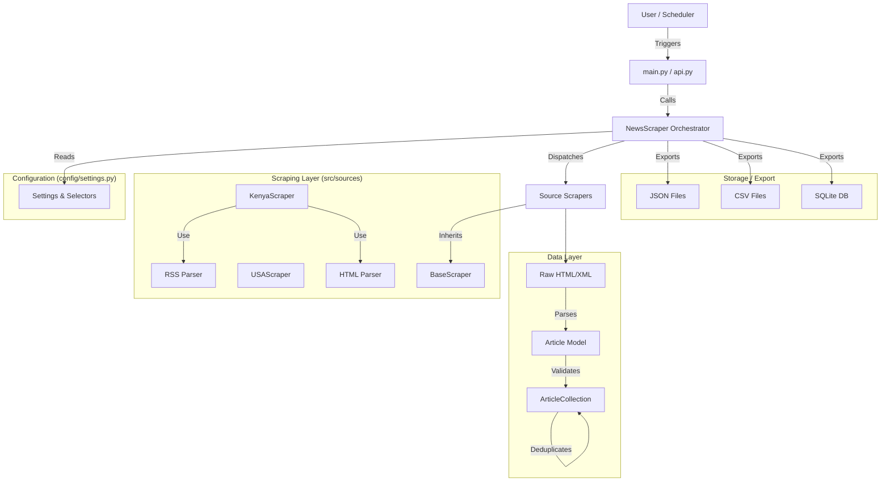
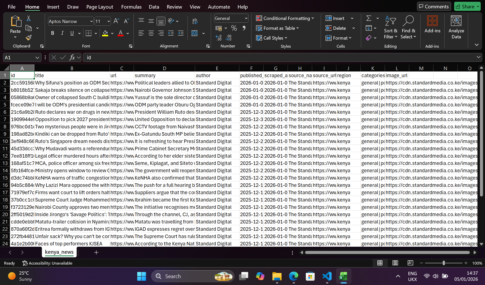
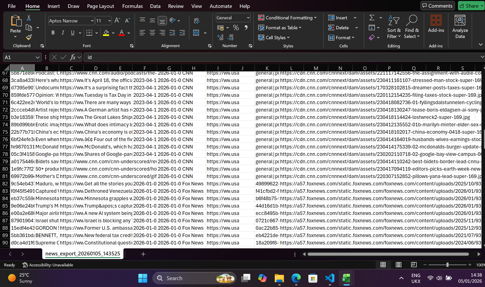
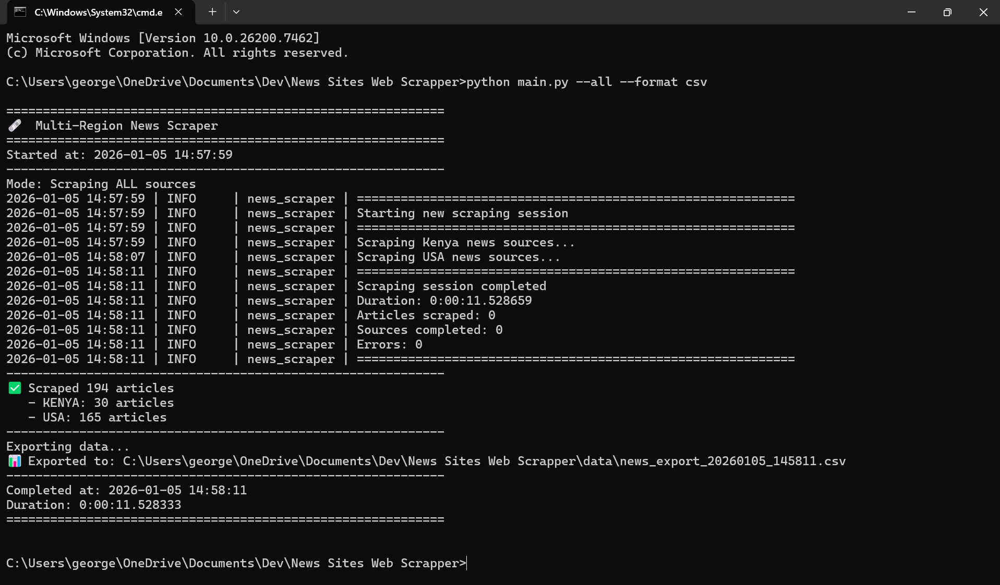

# 🗞️ Project Walkthrough: News Sites Web Scrapper

## 1. Project Overview
This system is a robust, production-ready web scraper designed to aggregate news articles from multiple regions (currently Kenya and USA). It is built to be **scalable**, **resilient** (handles network errors and rate limits), and **configurable**.

**Key Capabilities:**
- **Hybrid Scraping**: Uses RSS feeds for reliability and speed, falling back to HTML scraping when feeds aren't available.
- **Data Integrity**: Uses Pydantic models for strict data validation and deduplication.
- **Multi-Interface**: Can be run via Command Line Interface (CLI) for scheduled jobs or via a REST API for integration into other apps.
- **Politeness**: Built-in rate limiting and user-agent rotation to respect website policies.

---

## 2. System Architecture

The system follows a typical **ETL (Extract, Transform, Load)** pattern:



---

## 3. File Structure & Explanation

Here is why the project is structured this way:

### Root Directory
| File | Purpose |
|------|---------|
| `main.py` | **The CLI Entry Point.** Use this to run the scraper manually or set up a schedule. It parses command-line arguments and calls the scraper. |
| `api.py` | **The API Interface.** A Flask application that allows other programs to trigger scrapes or fetch data via HTTP endpoints. |
| `requirements.txt` | Lists all Python libraries required for the project. |

### Source Code (`src/`)
This folder contains the application logic, separated by responsibility.

| Directory | Purpose |
|-----------|---------|
| `models/` | **Data Structure.** Defines what an "Article" looks like. separating data definition from logic makes the code cleaner and less error-prone. |
| `sources/` | **The "Drivers".** Contains the code that knows how to talk to specific websites. `base.py` has the shared logic, while `kenya.py` and `usa.py` contain region-specific overrides. |
| `exporters/` | **Output Logic.** Handles saving data to different formats (JSON, CSV, SQL). If you wanted to add a "Send to Email" feature, you'd add a file here. |
| `utils/` | **Helpers.** Shared tools like the Logger, Rate Limiter, and Validators. These are used across the project to avoid code duplication. |
| `scraper.py` | **The Manager.** The `NewsScraper` class here ties everything together. It doesn't know how to scrape specifically, but it knows how to ask the `sources` to scrape and the `exporters` to save. |

### Configuration (`config/`)
| File | Purpose |
|------|---------|
| `settings.py` | **The Control Center.** This is where you define **what** to scrape (URLs, CSS selectors) and **how** (timeouts, rate limits). You can change the behavior of the scraper without touching the code logic. |

---

## 4. Code "Deep Dive"

### The Data Model (`src/models/article.py`)
Everything starts here. We use **Pydantic** to define an `Article` class.
- **Why?** It automatically validates data. If a scraper tries to save an article without a URL, the code will throw an error immediately, preventing bad data from entering your system.
- **Features:** It generates a unique ID for every article (`hashlib.md5(url+title)`) which allows us to easily detect and remove duplicates later.

### The Configuration (`config/settings.py`)
This file is a dictionary of dictionaries.
- **Key Concept:** **CSS Selectors**. Instead of hardcoding "find the div with class 'news-item'" inside the python code, we put it here:
  ```python
  'selectors': {
      'headline': 'h1, h2.headline',
      'summary': '.story-summary',
      ...
  }
  ```
  **Why?** If a website changes its design, you only update this config file. You don't need to rewrite the Python code.

### The Engine (`src/sources/base.py`)
This is the workhorse. The `BaseScraper` class implements:
1.  **Rate Limiting:** `DomainThrottler` ensures we don't hit a website too fast and get banned.
2.  **Retries:** The `@retry` decorator automatically retries a request if it fails (e.g., due to a temporary network blip).
3.  **User-Agent Rotation:** Pretends to be different browsers (Chrome, Firefox) to avoid detection.
4.  **Generic Extraction:** Methods like `_extract_text` and `_extract_image` handle the messy work of cleaning up HTML tags and whitespace.

### The Strategy (`src/sources/kenya.py`)
This file shows the "Strategy Pattern".
- It first tries to fetch data from an **RSS Feed** (which is structured and reliable).
- If that fails or isn't available, it falls back to **HTML Scraping** (downloading the webpage and looking for those CSS selectors defined in settings).

---

## 5. How to Use

### 1. From the Command Line (CLI)
Best for manual runs or cron jobs.

```bash
# Scrape everything
python main.py --all

# Scrape only Kenya news
python main.py --region kenya

# Scrape and save to CSV
python main.py --all --format csv --output my_news.csv
```

### 2. Via the API
Best for building a frontend or mobile app on top of this data.

1. Start the server:
   ```bash
   python api.py
   ```
2. Make requests:
   - **Trigger a scrape:** `POST http://localhost:5000/api/scrape`
   - **Get articles:** `GET http://localhost:5000/api/articles?region=kenya`

---

## 6. How to Add a New Source
To add a new news site (e.g., "Daily Nation"), you rarely need to write new code!

1. Open `config/settings.py`.
2. Add a new entry to the `KENYA_SOURCES` (or appropriate) list:
   ```python
   {
       'name': 'Daily Nation',
       'url': 'https://nation.africa',
       'selectors': {
           'article_list': 'article.story-card',  # The container for each news item
           'headline': 'h2.headline',             # Where the title is
           'link': 'a.story-link',                # Where the URL is
       },
       'enabled': True
   }
   ```
3. The `BaseScraper` will automatically read this and start scraping using the generic logic!

---

## 7. Key Concepts & Terminology

For developers new to this specific stack or scraping in general, here is a quick glossary of terms used in this project:

### 📡 Data & Protocols
- **RSS (Really Simple Syndication):** A standard web feed format that publishes frequently updated information (like blog entries or news headlines) in a structured XML format. It's excellent for scrapers because it's machine-readable and doesn't change often, unlike HTML layouts.
- **REST API (Representational State Transfer):** A way for two computer systems to communicate over HTTP. In this project, `api.py` allows other applications (like a mobile app) to "talk" to our scraper to request data or trigger jobs.
- **ETL (Extract, Transform, Load):** A data pipeline paradigm. **Extract** data from sources (the scraping part), **Transform** it into a clean format (cleaning text, parsing dates), and **Load** it into storage (saving to JSON/SQL).

### 🐍 Python Libraries
- **Pydantic:** A data validation library. It forces your data to match a specific "shape". If we expect an article title to be a string but get a number, Pydantic will yell (raise an error). This prevents "garbage in, garbage out".
- **Flask:** A lightweight web framework for building the API.
- **BeautifulSoup (bs4):** A classic library for pulling data out of HTML and XML files. It makes it easy to "navigate" the raw code of a webpage (e.g., "find all links inside the footer").

### 🛠️ Architecture Pattern
- **CLI (Command Line Interface):** A text-based interface used to operate software and operating systems. `main.py` is a CLI tool because you control it by typing commands like `--region kenya` rather than clicking buttons.
- **Decorator (`@retry`):** A design pattern in Python where you "wrap" a function to modify its behavior without changing its code. We use `@retry` to tell a function: "If you fail, wait 2 seconds and try again up to 3 times."
- **Singleton / Orchestrator:** The `NewsScraper` class acts as the "boss" or orchestrator. It doesn't do the heavy lifting itself; it delegates tasks to the specific source scrapers and exporters.
- **CSS Selectors:** Patterns used to select elements you want to style (in web design) or scrape (in our case). Example: `div.content > p` means "find every paragraph inside a div with the class 'content'".

### ⚡ Performance
- **Rate Limiting:** Deliberately slowing down your scraper to be "polite". If you hit a server 100 times a second, they will block you (IP Ban). We wait a few seconds between requests to mimic a human user.
- **Asynchronous (Async):** Doing multiple things at once. Instead of waiting for Website A to finish downloading before starting Website B, async allows us to start downloading both at the same time, speeding up the total time significantly.

---

## 8. Screenshots

Here are some screenshots of the application in action:


*Application Interface Overview*


*Scraping Process in Action*


*Data Output Example*
